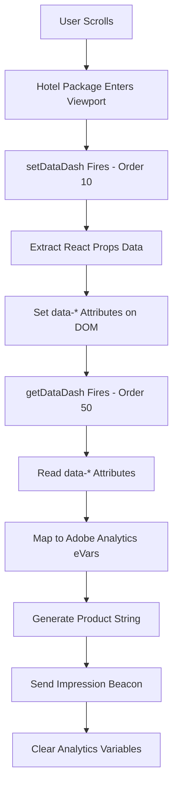

# Complete Hotel Impression Tracking System
## setDataDash() + getDataDash() - Viewport-Based Analytics

### **System Overview**
This documentation covers a sophisticated two-function impression tracking system that captures rich hotel merchandising data when search results become viewable to users. The system combines React data extraction, DOM attribute management, and Adobe Analytics integration to provide comprehensive business intelligence.

---

## **Architecture Overview**

### **Two-Phase System:**
```javascript
Phase 1: Data Collection & Preparation
├── setDataDash() [Rule Order: 10]
├── Triggers: Every time element enters viewport
├── Function: Extract React props → Set DOM attributes
└── Output: Rich data attributes on package containers

Phase 2: Analytics Processing & Tracking  
├── getDataDash() [Rule Order: 50]
├── Triggers: First time element enters viewport
├── Function: Read DOM attributes → Map to eVars → Send beacon
└── Output: Adobe Analytics impression event with merchandising data
```

### **Complete Workflow:**


---

## **Rule Configuration Summary**

### **setDataDash() Rule: `[10] setDataDash() [impression data tracking]`**
```javascript
Event: Enters Viewport (.package-info-container)
Frequency: every time element enters viewport
Conditions: 
  - page.pagename === "hotel selection"
  - sessionStorage.getItem('data-dash') != 'off'
Action: Custom Code - setDataDash()
```

### **getDataDash() Rule: `[50] getDataDash() [viewport change tracking]`**
```javascript
Event: Enters Viewport (.package-info-container)  
Frequency: first time element enters viewport
Conditions:
  - page.pagename === "hotel selection"
  - sessionStorage.getItem('data-dash') != 'off'
Actions: 
  1. Adobe Analytics - Clear Variables
  2. Custom Code - s.getDataDash()  
  3. Send Beacon - s.tl(o, "viewable impression")
  4. Adobe Analytics - Clear Variables
```

---

## **Data Flow Mapping**

### **Complete Data Pipeline:**

| React Props Source | setDataDash() Process | DOM Attribute | getDataDash() Input | Adobe Analytics |
|-------------------|----------------------|---------------|-------------------|-----------------|
| `detail.hotelOption.name` | Sanitize & extract | `data-hotelname` | `dataset.hotelname` | `eVar123` |
| `detail.hotelOption.starRating` | Direct extract | `data-hotelrating` | `dataset.hotelrating` | `eVar130` |
| `detail.hotelOption.hotelCode` | Direct extract | `data-hotelcode` | `dataset.hotelcode` | Product ID |
| `detail.hotelOption.chainCode` | Direct extract | `data-chaincode` | `dataset.chaincode` | `eVar138` |
| `detail.hotelOption.location.code` | Direct extract | `data-locationcode` | `dataset.locationcode` | `eVar143` |
| `detail.hotelOption.hotelType` | Join with pipe | `data-hotelcategory` | `dataset.hotelcategory` | `eVar137` |
| `detail.price.total.cash.amount` | Direct extract | `data-displayprice` | `dataset.displayprice` | `eVar139` |
| `detail.price.earn.total.earnQuantity` | Direct extract | `data-productearn` | `dataset.productearn` | `eVar128` |
| `detail.price.earn.total.earnAverageQuantity` | Direct extract | `data-avgearn` | `dataset.avgearn` | `eVar134` |
| `detail.hotelOption.images[0].category` | Safe extract | `data-propertythumbnail` | `dataset.propertythumbnail` | `eVar132` |
| `detail.price.prepay.promotions[0].code` | Array handling | `data-promocodes` | `dataset.promocodes` | `eVar154` |
| `Array index + 1` | Calculate position | `data-order` | `dataset.order` | `eVar133` |

---

## **Technical Implementation Details**

### **setDataDash() - Data Extraction Engine**
```javascript
Key Features:
✓ React props discovery via __reactProps pattern
✓ Deep object traversal for hotel and pricing data  
✓ Character sanitization for product string compatibility
✓ Array vs string handling for promotional codes
✓ Position calculation and assignment
✓ Duplicate processing prevention
✓ Multi-level error handling with specific contexts
```

### **getDataDash() - Analytics Integration Engine**  
```javascript
Key Features:
✓ Efficient DOM dataset reading
✓ Structured eVar mapping object
✓ Dynamic product string generation
✓ Comprehensive linkTrackVars configuration
✓ Custom link tracking beacon
✓ Variable clearing for data integrity
✓ Error isolation and tracking
```

---

## **Adobe Analytics Output**

### **Impression Event Structure:**
```javascript
Event: event73 (Hotel Impression Counter)
Product String: "hotel;[hotelCode];;;event73=1;[merchandising_eVars]"
Link Type: "viewable impression"
Beacon Type: s.tl() - Link tracking call

Example Hit:
s.events = "event73"
s.products = "hotel;GBR123;;;event73=1;eVar123=Grand Beach Resort|eVar130=4|eVar139=1299.99|eVar137=Resort|Beach|eVar133=3|eVar138=GRAND|eVar143=CUN|eVar134=650|eVar128=750|eVar132=no image|eVar154=SAVE20"
s.contextData["load_rule_name"] = "[50] getDataDash() [viewport change tracking]"
```

### **Available Analytics Dimensions:**
```javascript
Hotel Attributes:
- Hotel Name (eVar123)
- Star Rating (eVar130)  
- Chain Code (eVar138)
- Category/Type (eVar137)
- Location Code (eVar143)

Business Metrics:
- Display Price (eVar139)
- Position in Results (eVar133)
- Points Earning (eVar128, eVar134)
- Promotional Codes (eVar154)
- Image Category (eVar132)
```

---

## **Business Intelligence Capabilities**

### **Viewability Analytics:**
- **Impression Rates**: Which hotels get viewed vs just displayed
- **Scroll Depth Analysis**: How far users scroll through results
- **Position Impact**: Effect of search ranking on viewability
- **Price vs Viewability**: Correlation between price and impressions

### **Hotel Performance Metrics:**
- **Top Viewed Properties**: Most impressive hotels by destination
- **Category Performance**: Resort vs City vs Boutique viewability
- **Chain Analysis**: Brand performance across markets
- **Promotional Effectiveness**: Promo code impact on impressions

### **User Behavior Insights:**
- **Search Result Consumption**: How many results users actually view
- **Price Sensitivity**: Viewing patterns by price range
- **Feature Preferences**: Image, rating, category influence on views
- **Geographic Patterns**: Location preference analysis

---

## **Performance & Reliability**

### **System Optimizations:**
```javascript
Data Extraction Efficiency:
- Single DOM query with Array.from conversion
- Direct React props access via __reactProps
- Efficient object traversal patterns
- Minimal memory footprint with temporary arrays

Analytics Processing Speed:
- Direct dataset attribute reading
- Object-based eVar mapping for maintainability  
- Pre-defined linkTrackVars array
- Lightweight link tracking calls

Error Resilience:
- Multi-level try/catch blocks
- Specific error context tracking
- Graceful degradation on partial failures
- Global error monitoring integration
```

### **Reliability Features:**
```javascript
Duplicate Prevention:
- setDataDash: Checks for existing data-hotelCode attribute
- getDataDash: First-time-only viewport triggering
- Variable clearing between beacons

Data Quality Assurance:
- Character sanitization for product strings
- Optional chaining for uncertain data
- Type checking and validation
- Error tracking with window.failedCode
```

---

## **Implementation Best Practices**

### **Rule Order Dependency:**
```javascript
Critical: setDataDash (Order 10) MUST fire before getDataDash (Order 50)
- Ensures data attributes are set before analytics processing
- Prevents undefined dataset values
- Maintains data integrity across viewport events
```

### **Viewport Event Configuration:**
```javascript
setDataDash: "every time element enters viewport"
- Refreshes data on re-entry (user scrolls back up)
- Handles dynamic content updates
- Ensures current pricing/availability

getDataDash: "first time element enters viewport"  
- Prevents duplicate impression tracking
- Maintains accurate impression counts
- Optimizes beacon frequency
```

### **Error Monitoring Strategy:**
```javascript
Global Error Array: window.failedCode
- Centralizes error collection across both functions
- Provides context with rule names and error messages
- Enables real-time monitoring and alerting
- Supports debugging and maintenance
```

---

## **Troubleshooting Guide**

### **Common Issue Resolution:**

#### **Problem: No impression events firing**
```javascript
Diagnosis Steps:
1. Check page.pagename data element value
2. Verify sessionStorage data-dash setting  
3. Confirm .package-info-container elements exist
4. Validate rule order (setDataDash = 10, getDataDash = 50)
5. Check network tab for s.tl() calls

Debug Commands:
console.log(_satellite.getVar('page.pagename'))
console.log(sessionStorage.getItem('data-dash'))
console.log(document.querySelectorAll('.package-info-container').length)
```

#### **Problem: Missing merchandising data**
```javascript
Diagnosis Steps:
1. Verify setDataDash executed first
2. Check for React props structure changes
3. Validate data attribute presence
4. Review error tracking output

Debug Commands:
console.log(document.querySelector('.package-info-container').dataset)
console.log(window.failedCode)
setDataDash() // Manual execution
```

#### **Problem: Duplicate impressions**
```javascript
Diagnosis Steps:
1. Verify getDataDash frequency setting
2. Check for multiple rule instances
3. Validate event configuration

Solution:
Ensure getDataDash uses "first time element enters viewport"
```

---

## **Future Enhancement Opportunities**

### **Advanced Analytics:**
- **Real-time pricing updates** during viewport visibility
- **Time-based impression analysis** (how long viewed)
- **Click prediction modeling** based on impression data
- **A/B testing integration** for search result optimization

### **Performance Optimizations:**
- **Intersection Observer API** for more efficient viewport detection
- **Web Workers** for React props processing
- **Debounced execution** for rapid scroll scenarios
- **Lazy loading integration** with impression tracking

### **Business Intelligence Extensions:**
- **Revenue correlation** with impression data
- **Conversion funnel analysis** from impression to booking
- **Competitive analysis** through chain/property performance
- **Seasonal/temporal pattern analysis** for hotel visibility

---

## **Summary**

This impression tracking system represents a production-ready, enterprise-grade solution that:

✅ **Accurately captures viewable impressions** without technical overhead  
✅ **Provides rich merchandising data** for business intelligence  
✅ **Integrates seamlessly** with Adobe Analytics infrastructure  
✅ **Maintains high performance** with minimal user impact  
✅ **Offers comprehensive error handling** for operational reliability  
✅ **Supports advanced analytics** use cases and business optimization  

The combination of `setDataDash()` and `getDataDash()` creates a powerful foundation for understanding user engagement with hotel search results and optimizing the travel booking experience through data-driven insights. 