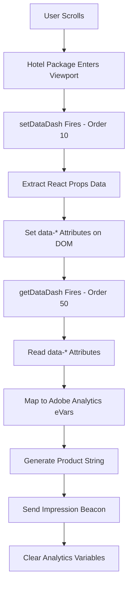

# Southwest Airlines Tag Manager Documentation
## Adobe Launch Implementation & Hotel Impression Tracking System

### **Repository Overview**
This repository contains comprehensive documentation for Southwest Airlines' Adobe Experience Cloud implementation, focusing on the vacation booking platform's sophisticated tag management and impression tracking systems.

---

## **📋 Documentation Contents**

### **Core Adobe Launch Implementation**
- **[Adobe Launch Tag Manager Documentation](Adobe_Launch_Tag_Manager_Documentation.md)** - Complete overview of the 22,667-line tag manager implementation
- **[Tag Manager Code Analysis](tagManager.js)** - Original exported tag manager JavaScript file

### **Custom Impression Tracking System**
- **[setDataDash() Documentation](setDataDash_Documentation.md)** - Data extraction and DOM attribute setting
- **[getDataDash() Documentation](getDataDash_Documentation.md)** - Analytics processing and beacon firing  
- **[Complete Impression Tracking System](Complete_Impression_Tracking_System.md)** - End-to-end system overview
- **[setDataDash() Code](setDataDash.js)** - Source code for data extraction function
- **[getDataDash() Code](getDataDash.js)** - Source code for analytics function

---

## **🏗️ System Architecture**

### **Adobe Experience Cloud Stack**
```
├── Adobe Launch (Experience Platform Tags)
├── Adobe Analytics (with 200+ data elements)
├── Adobe Target v2 (Server-side decisioning)
├── Experience Cloud ID Service
└── Custom Data Layer Extension (GCOE)
```

### **Impression Tracking Workflow**


---

## **🚀 Key Features**

### **Advanced Analytics Capabilities**
- **200+ Data Elements** capturing comprehensive travel context
- **Sophisticated Event Tracking** across the customer journey
- **Custom Error Monitoring** with `window.failedCode` array
- **Performance Optimization** with Adobe Consulting Plugins
- **Cross-Visit Attribution** and customer lifetime tracking

### **Viewport-Based Impression Tracking**
- **React Props Extraction** from dynamic hotel search results
- **Rich Merchandising Variables** (11+ eVars per impression)
- **Accurate Viewability Measurement** using viewport events
- **Error-Resilient Processing** with multi-level error handling
- **Business Intelligence Ready** analytics output

### **Travel Industry Optimizations**
- **Multi-Product Support**: Hotels, flights, cars, packages
- **Dynamic Pricing Tracking** with promotional code handling
- **Customer Tier Integration** (member status, points, rewards)
- **Search Context Preservation** across booking funnel
- **Revenue Attribution** from search to purchase

---

## **📊 Analytics Variables Overview**

### **Key Conversion Variables (eVars)**
- **eVar1**: Data channel
- **eVar123**: Hotel name (merchandising)
- **eVar128**: Product earning points (merchandising)
- **eVar130**: Star rating (merchandising)
- **eVar133**: Search result position (merchandising)
- **eVar137**: Hotel category (merchandising)
- **eVar139**: Display price (merchandising)
- **eVar176**: Click tracking parameters

### **Custom Events**
- **event1**: Page views/visits
- **event73**: Hotel impressions
- **event83**: Click actions
- **event9**: Time to purchase (minutes)
- **event18**: Search events
- **event20**: Unique destination searches

---

## **🔧 Implementation Highlights**

### **Technical Architecture**
- **Environment**: Development (with production configuration)
- **Build Date**: 2025-06-30T12:57:30Z
- **Turbine Version**: 28.0.0
- **Organization**: 65D316D751E563EC0A490D4C@AdobeOrg

### **Performance Features**
- **Efficient Data Extraction** via React props discovery
- **Viewport-Optimized Tracking** preventing unnecessary processing
- **Error Isolation** ensuring system resilience
- **Memory Management** with cleanup and variable clearing

### **Business Intelligence Integration**
- **Adobe Analytics Workspace** ready dimensions
- **Product String Merchandising** for detailed analysis
- **Customer Journey Mapping** across touchpoints
- **Revenue Optimization** insights and reporting

---

## **📁 File Structure**

```
├── README.md                                    # This overview document
├── docs/
│   ├── Adobe_Launch_Tag_Manager_Documentation.md  # Complete tag manager analysis
│   ├── setDataDash_Documentation.md              # Data extraction documentation
│   ├── getDataDash_Documentation.md              # Analytics processing documentation
│   └── Complete_Impression_Tracking_System.md   # End-to-end system overview
├── src/
│   ├── tagManager.js                             # Exported tag manager code
│   ├── setDataDash.js                           # Data extraction function
│   └── getDataDash.js                           # Analytics processing function
└── assets/
    └── screenshots/                              # Adobe Launch UI screenshots
```

---

## **🎯 Use Cases**

### **For Analytics Teams**
- Understanding the complete data collection strategy
- Implementing similar impression tracking systems
- Optimizing Adobe Analytics variable allocation
- Setting up advanced travel industry tracking

### **For Development Teams**
- React integration patterns with analytics
- Viewport-based event handling
- Error monitoring and debugging strategies
- Performance optimization techniques

### **For Business Intelligence**
- Available data dimensions and metrics
- Customer journey analysis capabilities
- Revenue attribution methodologies
- Travel industry KPI tracking

---

## **📈 Business Impact**

### **Data-Driven Insights Enabled**
- **Hotel Performance Analytics**: Impression rates, viewability analysis
- **User Behavior Tracking**: Scroll depth, engagement patterns
- **Revenue Optimization**: Price sensitivity, conversion attribution
- **Inventory Management**: Popular vs ignored properties
- **Marketing Effectiveness**: Promotional code impact analysis

### **Operational Benefits**
- **Real-Time Monitoring**: Error tracking and performance metrics
- **Debugging Capabilities**: Comprehensive error logging and context
- **Scalable Architecture**: Supports business growth and feature expansion
- **Compliance Ready**: Privacy controls and consent management

---

## **🔮 Future Enhancements**

### **Planned Improvements**
- Enhanced privacy and consent management (GDPR/CCPA)
- Real User Monitoring (Core Web Vitals)
- Advanced customer journey analytics
- Machine learning-powered personalization
- Real-time data streaming capabilities

### **Technical Roadmap**
- Intersection Observer API implementation
- Web Workers for data processing
- Enhanced error reporting and alerting
- Performance budgets and monitoring
- A/B testing framework integration

---

## **📞 Support & Maintenance**

### **Monitoring**
- **Error Tracking**: `window.failedCode` array monitoring
- **Data Quality**: Adobe Analytics variable validation
- **Performance**: Viewport event timing analysis
- **Business Metrics**: Impression tracking accuracy

### **Troubleshooting**
Refer to individual documentation files for specific debugging guides and common issue resolution.

---

## **📄 License**
This documentation is proprietary to Southwest Airlines and intended for internal use and approved partners only.

---

## **🤝 Contributing**
For updates or improvements to this documentation, please follow Southwest Airlines' internal development processes and approval workflows.

---

**Last Updated**: January 2025  
**Maintained By**: Analytics & Tag Management Team  
**Version**: 1.0.0 